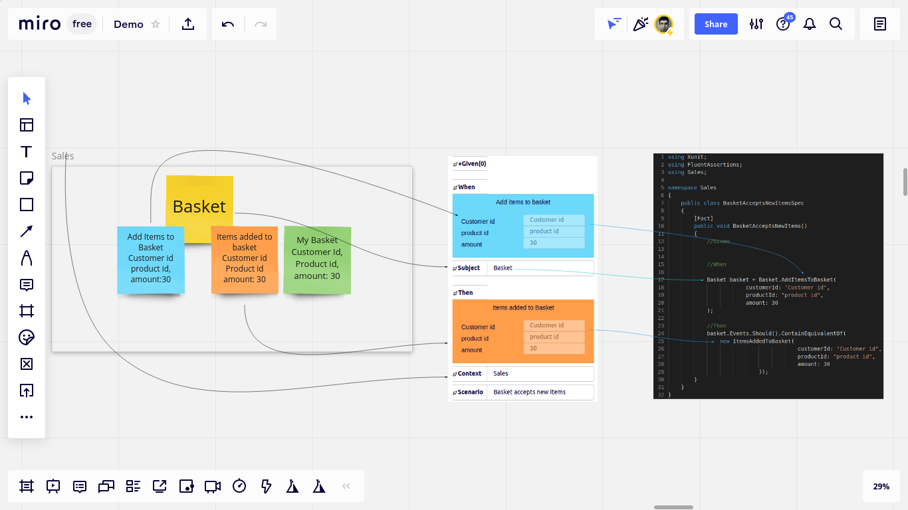

# Miro extension for Scenario Hunting

### An implementation of [Scenario Hunting](https://www.scenariohunting.com) framework as an extension to Miro whiteboard.

Scenario Hunting method comprises a set of steps to derive high-quality automated tests by visual collaborative modeling artifacts (such as Event Storming and Event Modeling artifacts). 
Following the steps protects the design from distortion during implementation.

By [installing](https://miro.com/oauth/authorize/?response_type=code&client_id=3074457356753256770&redirect_uri=%2Fconfirm-app-install%2F) this extension to your Miro board you can hunt for scenarios from visual models on Miro board.

## Features
* **Template Studio:** The builtin code editor for repl driving test templates
* **Scenario Builder:** Helps scenario hunters build abstract visual scenarios by clicking on widgets on the whiteboard.
* **Scenario Compiler:** The backend component that compiles the abstract scenario to concrete test code based on template of choice.

##  How it works

5 Minute Demo: Hunting Scenarios from an Event Model

5 Minute Demo: Hunting scenatrios from Event Storming artifacts

## How to install
Simply click [here](https://miro.com/oauth/authorize/?response_type=code&client_id=3074457356753256770&redirect_uri=%2Fconfirm-app-install%2F) to install the [Miro](https://miro.com) addon. 

## Steps:
* Visually extract a test scenario from models
* Save the scenario as test code
* Pass the test
* Refactor
* Update the model
* Repeate

## Documentation
[See](https://docs.scenariohunting.com) the documentation.

## License

Licensed under the [apache](LICENSE) license version 2.0. 
