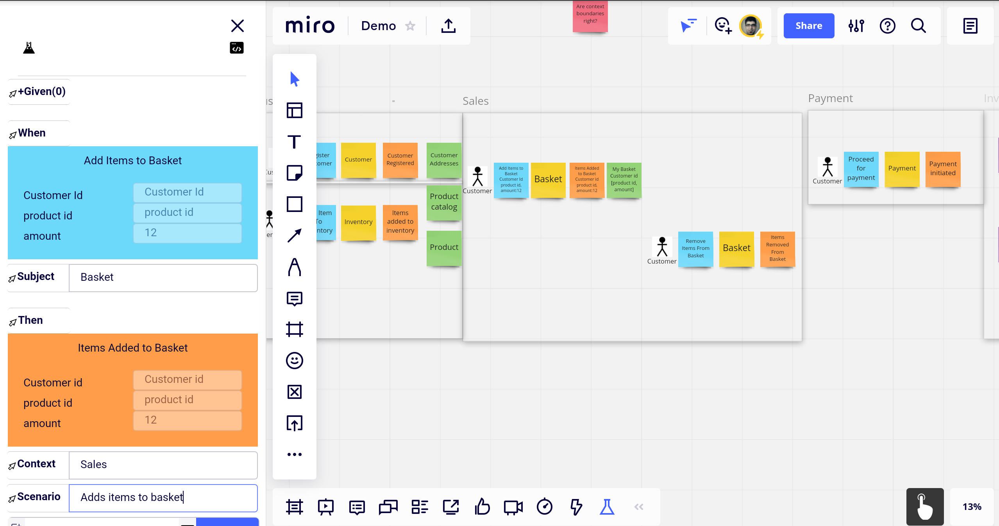

# Scenario Hunting

A software design workflow which maximizes knowledge discovery by asking to clarify causality across design elements, then automatically forges the artifacts into test code to get instant feedback from the design decisions, and streamline communication and training.

### How to install
Simply click [here](https://miro.com/oauth/authorize/?response_type=code&client_id=3074457356753256770&redirect_uri=%2Fconfirm-app-install%2F) to install the [Miro](https://miro.com) addon. 

## Privacy

The application is hosted by github pages, runs on your browser, and stores the data on your miro board. 
No backend, no data collection, no worries. 

## License

Licensed under the [apache](LICENSE) license version 2.0. 
