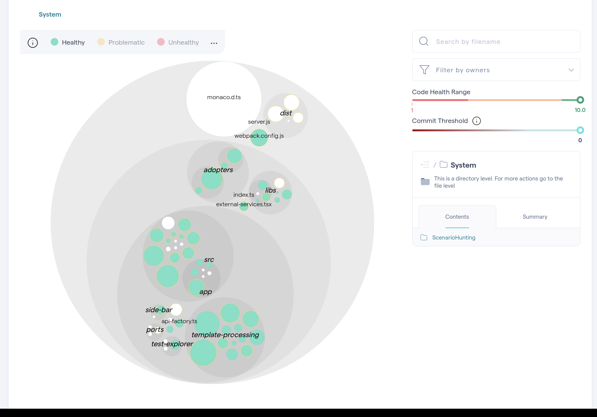
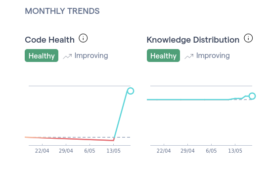
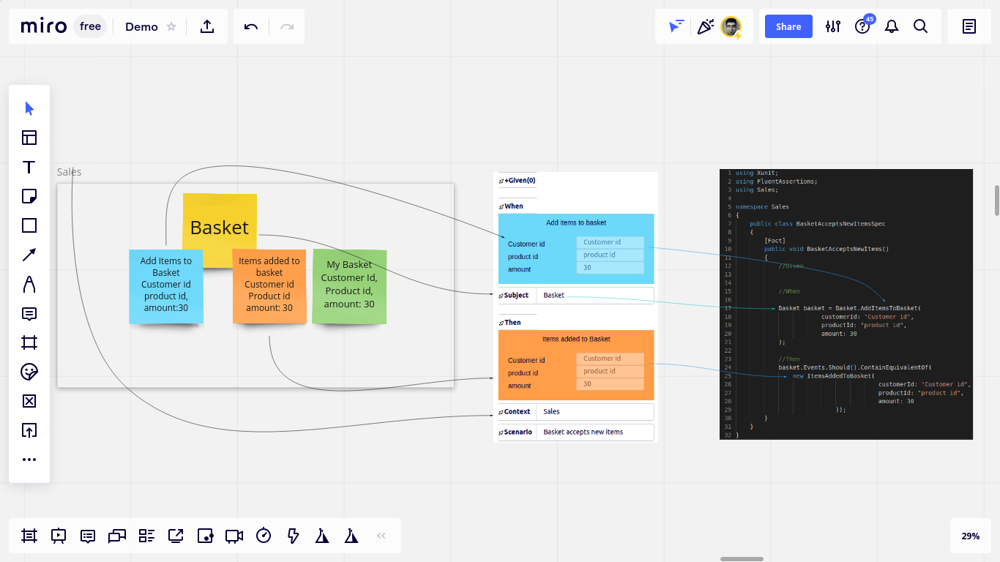
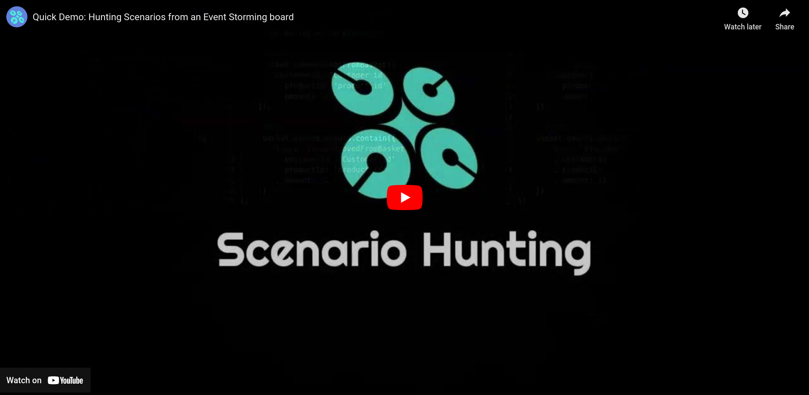

# Miro extension for Scenario Hunting

### An implementation of [Scenario Hunting](https://scenariohunting.com) framework as an extension to Miro whiteboard.

## Project Evolution

This project began as a *prototypical proof of concept*, with the initial codebase laying the groundwork for what has become a continually evolving open-source endeavor. Over time, we've refined the architecture, enhanced functionality, and improved performance. We're committed to further development, and we welcome new ideas and improvements as we advance.

Scenario Hunting is a set of steps to implement high-quality automated tests based on visual modeling artifacts (such as Event Storming and Event Modeling sticky notes). 
Following the steps keeps implementation on track and protects the design from distortion while coding.

By [installing](https://miro.com/oauth/authorize/?response_type=code&client_id=3074457356753256770&redirect_uri=%2Fconfirm-app-install%2F) this extension to your Miro board, you can hunt for test scenarios from visual models on your Miro boards.

## Features
* **Template Studio:** The builtin code editor for repl driving test templates
* **Scenario Builder:** Helps scenario hunters build abstract visual scenarios by clicking on widgets on the whiteboard.
* **Scenario Compiler:** The backend component that translates the abstract scenario to concrete test code based on the template of choice.

##  How it works

The following 4 Minute demo explains hunting scenarios from Event Storming artifacts.

## How to install
Simply click [here](https://miro.com/oauth/authorize/?response_type=code&client_id=3074457356753256770&redirect_uri=%2Fconfirm-app-install%2F) to install the [Miro](https://miro.com) addon. 

## Steps:
* Visually extract a test scenario from models
* Save the scenario as test code
* Pass the test
* Refactor
* Update the model
* Repeat

## Documentation
[See](https://docs.scenariohunting.com) the documentation.

## License

Licensed under the [apache](LICENSE) license version 2.0. 
